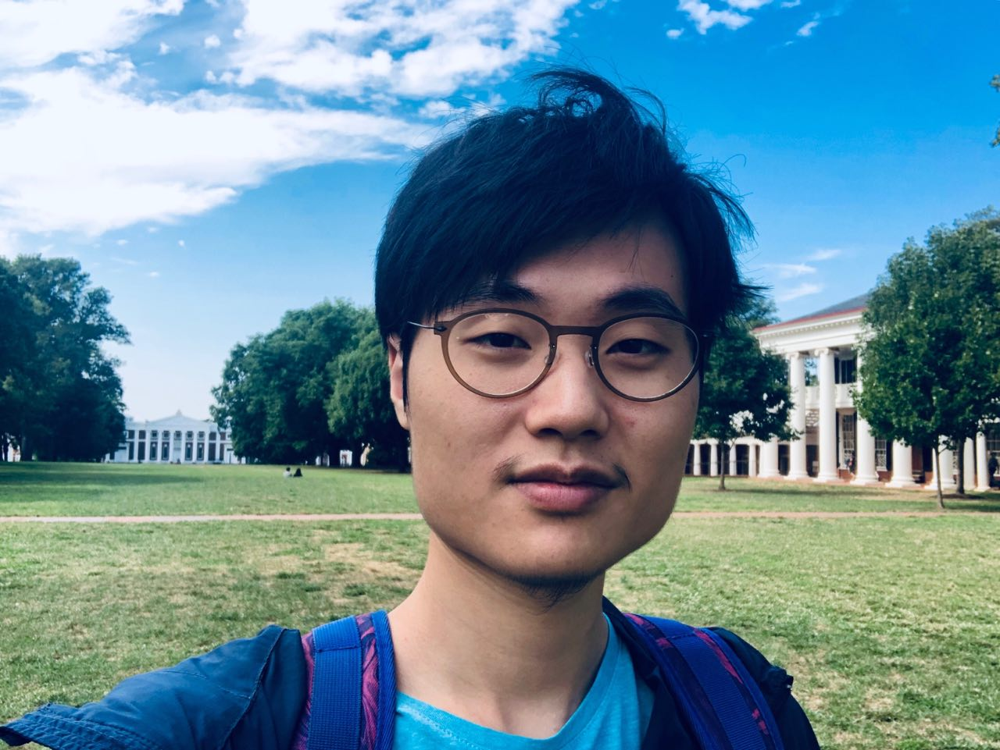

<link href="https://fonts.googleapis.com/css?family=Noto+Serif+SC" rel="stylesheet">

# 

Sanxing Chen
 
陈三星

## Bio

I'm a first-year master student in computer science at the [University of Virginia](https://engineering.virginia.edu/departments/computer-science), where I work with Prof. [Yangfeng Ji](http://yangfengji.net) in natural language processing (NLP).

My long-term research interest lies primarily in helping computers to learn natural languages in the way humans do.
Language is the [conduit](https://en.wikipedia.org/wiki/Conduit_metaphor) which bridges different forms of knowledge.
But, by itself, it doesn't necessarily contain sufficient information.
That's why I'm currently focusing on grounded language learning,
especially in finding intuitive algorithms to connect languages with various worlds.

I was lucky to be exposed to a few NLP research studies early at college.
For instance, I worked on domain adaptation for machine translation with Prof. [Xiaohui Ji](https://www.researchgate.net/scientific-contributions/69798625_Xiaohui_Ji). 
And I spent nearly one year interned at the Microsoft Research Asia with the BotSys team (part of the BDM group or the [KC](https://www.microsoft.com/en-us/research/group/knowledge-computing/) group) 
where I was working on [generic types entity recognition](https://github.com/Microsoft/Recognizers-Text) under the supervision of Dr. [Börje Karlsson](https://www.microsoft.com/en-us/research/people/borjekar/) and [Guoxin Wang](https://www.microsoft.com/en-us/research/people/guow/).

## News  :tada:

- **[Jan 19, 2020]** I'll be with Microsoft Advertising and [MSR](https://www.microsoft.com/en-us/research/group/deep-learning-group/) this summer!
- **[Dec 21, 2019]** I'm actively seeking R&D internship opportunities for summer 2020!
- **[Dec 10, 2019]** We submitted one paper to ACL 2020!

<!-- - **[Mar 28, 2019]** Got accepted to MSCS@[UMass](https://umass.edu)!
- **[Feb 27, 2019]** I'm going to rejoin MSRA in April, excited to see my old friends there!
- **[Feb 21, 2019]** Got accepted to MSCS@[UVa](http://virginia.edu)!
- **[Dec 16, 2018]** All MS/Ph.D. applications sent out! -->

## Service

- Program committee member: COLING'2020

## Misc

- My name is pronounced as "sǣnɕə̄ŋ".
- I come from [Quanzhou](https://en.wikipedia.org/wiki/Quanzhou).
- I started playing the violin when I was a little boy.

## Contact

:email:

- sc3hn [at] virginia [dot] edu
- staychan [dot] cn [at] gmail [dot] com

:bird:

<a class="twitter-timeline" data-lang="en" data-width="390" data-height="600" data-theme="light" data-link-color="#e57200" href="https://twitter.com/sanxing_chen/likes?ref_src=twsrc%5Etfw">Tweets Liked by @sanxing_chen</a> 